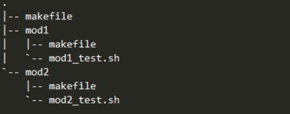

# C++编译耗时优化

大型C++工程项目，都会面临编译耗时较长的问题。整理几招 优化编译时间过长的方法。

1. 预编译头文件

    在介绍预编译头之前，有必要了解一下C/C++的编译方式。C/C++的编译单元是源文件（带有.c、.cc、.cpp等扩展名的文件），在编译一个源文件之前，预处理器会把这个源文件中所有通过#include指令包含进来的头文件递归地展开，也就是把所有直接或间接包含的头文件原封不动地插入进来。当这个过程结束之后，才开始编译。

    这种编译方式的缺点是会使头文件被重复编译。假如有一百个源文件都包含了Windows.h，那么这个头文件会在一百个源文件中展开，它里面的代码会被重复编译了一百次，尽管每次编译的结果都相同。对于具有成千上万个源文件的大型项目来说，重复编译是难以接受的，会浪费大量的编译时间。

    **为了解决这个问题，预编译头应运而生**。顾名思义，预编译头就是预先把头文件编译好，在编译源文件的时候直接取用这些编译结果，避免对头文件重复编译。这项技术能大幅提高C++的编译速度。


*   预编译头文件使用注意事项：

    1. 既然预编译头有这样的好处，那么是不是加入预编译的头文件越多越好呢？答案是否定的。上文已经提到，使用预编译头的时候必须在所有源文件中包含预编译头文件，由此造成的影响是，一旦其中的头文件发生了变化，不论这个变化有多细微，整个项目都要重新编译。把一个会被频繁修改的头文件包含到预编译头文件中是非常不明智的做法，因此，理想的选择是下列几乎不会修改的头文件

    2. **预编译头文件只能使用一个，不能在一个cpp文件中include多个gch文件。**

    3. **在cpp文件中，如果要使用gch，gch一定要放在include的第一个文件。**

    如果不满足2和3，预编译头文件也是没效果啊！！！！

    https://stackoverflow.com/questions/12437955/gcc-and-precompiled-headers/12438040#12438040?newreg=2f0c19d30d2d4dd99dfda4f2aa21dd66

* 举个例子

    ```
    # 假设 main.cpp 是程序的核心逻辑， comm1.cpp comm2.cpp 是两个底层库 并且不经常修改
    # main.cpp 可以使用他们的预编译头文件
    # 这样在编译mian.cpp的时候，预处理阶段 就不会再次展开include这个头文件在找一次了
    ls
    comm1.cpp  comm1.h  comm2.cpp  comm2.h  comm_header.h  main.cpp
    ```

    main.cpp文件入下： （include了底层的头文件）
    ```
    $ cat main.cpp
    
    #include "comm_header.h"
    #include <stdio.h>
    int main()
    {
        
        printf("hello world, val %d\n", comm2_show());
        printf("hello world, val %d\n", comm1_show());
        return 0;
    }
    ```

    ```
    # 预编译头文件 ，这里会生成一个gch的文件
    g++ -x c++-header comm_header.h 
    ```

    在生成gch文件之后，再次编译main.cpp的文件，编译器在这里就会先找gch文件，如果找到了就用它。找不到就使用原来的头文件。

    然后，也可以使用gcc -H 这个命令查看是否有使用预编译的头文件。
    ```
    $ g++ -H main.cpp
    ! comm_header.h.gch
    main.cpp
    . /usr/include/stdio.h
    .. /usr/include/features.h
    ... /usr/include/sys/cdefs.h
    .... /usr/include/bits/wordsize.h
    ... /usr/include/gnu/stubs.h
    .... /usr/include/gnu/stubs-64.h
    .. /usr/lib/gcc/x86_64-redhat-linux/4.8.5/include/stddef.h
    .. /usr/include/bits/types.h
    ... /usr/include/bits/wordsize.h
    ... /usr/include/bits/typesizes.h
    .. /usr/include/libio.h
    ... /usr/include/_G_config.h
    .... /usr/lib/gcc/x86_64-redhat-linux/4.8.5/include/stddef.h
    .... /usr/include/wchar.h
    ... /usr/lib/gcc/x86_64-redhat-linux/4.8.5/include/stdarg.h
    .. /usr/include/bits/stdio_lim.h
    .. /usr/include/bits/sys_errlist.h
    Multiple include guards may be useful for:
    /usr/include/bits/stdio_lim.h
    /usr/include/bits/sys_errlist.h
    /usr/include/bits/typesizes.h
    /usr/include/gnu/stubs-64.h
    /usr/include/gnu/stubs.h
    /usr/include/wchar.h
    /tmp/ccACOfpF.o: In function `main':
    main.cpp:(.text+0x5): undefined reference to `comm2_show()'
    main.cpp:(.text+0x1b): undefined reference to `comm1_show()'
    collect2: error: ld returned 1 exit status
    ```

    当删除gch文件后，再次查看，现在找不到gch了，无法使用预编译的结果了，使用原来的正常头文件进行编译。
    ```
    $rm comm_header.h.gch 
    $g++ -H main.cpp         

    . comm_header.h
    .. comm1.h
    .. comm2.h
    . /usr/include/stdio.h
    .. /usr/include/features.h
    ... /usr/include/sys/cdefs.h
    .... /usr/include/bits/wordsize.h
    ... /usr/include/gnu/stubs.h
    .... /usr/include/gnu/stubs-64.h
    .. /usr/lib/gcc/x86_64-redhat-linux/4.8.5/include/stddef.h
    .. /usr/include/bits/types.h
    ... /usr/include/bits/wordsize.h
    ... /usr/include/bits/typesizes.h
    .. /usr/include/libio.h
    ... /usr/include/_G_config.h
    .... /usr/lib/gcc/x86_64-redhat-linux/4.8.5/include/stddef.h
    .... /usr/include/wchar.h
    ... /usr/lib/gcc/x86_64-redhat-linux/4.8.5/include/stdarg.h
    .. /usr/include/bits/stdio_lim.h
    .. /usr/include/bits/sys_errlist.h
    Multiple include guards may be useful for:
    /usr/include/bits/stdio_lim.h
    /usr/include/bits/sys_errlist.h
    /usr/include/bits/typesizes.h
    /usr/include/gnu/stubs-64.h
    /usr/include/gnu/stubs.h
    /usr/include/wchar.h
    /tmp/ccSGFuir.o: In function `main':
    main.cpp:(.text+0x5): undefined reference to `comm2_show()'
    main.cpp:(.text+0x1b): undefined reference to `comm1_show()'
    collect2: error: ld returned 1 exit status
    ```

    当然，如果交换了头文件的顺序。没有把预编译的头文件放到第一个，这样也是不会生效的啊！！！！！
    ```
    #include <stdio.h>
    #include "comm_header.h"

    int main()
    {
        
        printf("hello world, val %d\n", comm2_show());
        printf("hello world, val %d\n", comm1_show());
        return 0;
    }
    ```

    ```
    $ g++ -H main.cpp
    . /usr/include/stdio.h
    .. /usr/include/features.h
    ... /usr/include/sys/cdefs.h
    .... /usr/include/bits/wordsize.h
    ... /usr/include/gnu/stubs.h
    .... /usr/include/gnu/stubs-64.h
    .. /usr/lib/gcc/x86_64-redhat-linux/4.8.5/include/stddef.h
    .. /usr/include/bits/types.h
    ... /usr/include/bits/wordsize.h
    ... /usr/include/bits/typesizes.h
    .. /usr/include/libio.h
    ... /usr/include/_G_config.h
    .... /usr/lib/gcc/x86_64-redhat-linux/4.8.5/include/stddef.h
    .... /usr/include/wchar.h
    ... /usr/lib/gcc/x86_64-redhat-linux/4.8.5/include/stdarg.h
    .. /usr/include/bits/stdio_lim.h
    .. /usr/include/bits/sys_errlist.h
    . comm_header.h
    .. comm1.h
    .. comm2.h
    Multiple include guards may be useful for:
    /usr/include/bits/stdio_lim.h
    /usr/include/bits/sys_errlist.h
    /usr/include/bits/typesizes.h
    /usr/include/gnu/stubs-64.h
    /usr/include/gnu/stubs.h
    /usr/include/wchar.h
    /tmp/cccPO3oj.o: In function `main':
    main.cpp:(.text+0x5): undefined reference to `comm2_show()'
    main.cpp:(.text+0x1b): undefined reference to `comm1_show()'
    collect2: error: ld returned 1 exit status
    ```

    在大型项目里面预编译头文件是可以很明显的加快编译速度的。

----

2. 并行编译

    修改make的逻辑，将没有依赖的独立的底层模块尽可能的并行编译。

    比如下面这样，想让mod1和mod2并行编译的话。

    

    ```
    # 模块1 和 模块2 并行编译
    MAKE=make -s 
    PARALLEL_ARG =-j 20

    SUBDIRS_MOD1 = mod1  # 独立的模块1
    SUBDIRS_MOD2 = mod2  # 独立的模块2

    .PHONY: all	$(SUBDIRS_MOD1) $(SUBDIRS_MOD2) 

    all: 
        $(MAKE) $(PARALLEL_ARG) $(SUBDIRS_MOD1) $(SUBDIRS_MOD2);

    $(SUBDIRS_MOD1):
        echo "mod 1" 
        $(MAKE)  -C $@

    $(SUBDIRS_MOD2):
        echo "mod 2"
        $(MAKE) -C $@
    ```

    这样两个mod是同时开始进行编译的。不会先编译mod1，等mod1好了在编译mod2。这里使用的前提是，项目里面已经调整好了依赖的部分，mod1和mod2不会相互依赖（或者依赖的部分已经抽离出去，提前编译好了）。

    在Linux平台上一般使用GNU的Make工具进行编译，在执行make命令时可以加上-j参数增加编译并行度，如make -j 4将开启4个任务。在实践中我们并不将该参数写死，而是通过$(nproc)方法动态获取编译机的CPU核数作为编译并发度。

----

3. ccache 

    CCache（Compiler Cache是一个编译缓存工具，其原理是将cpp的编译结果保存在文件缓存中，以后编译时若对应文件无变动可直接从缓存中获取编译结果。需要注意的是，Make本身也有一定缓存功能，当目标文件已编译（且依赖无变化）时，若源文件时间戳无变化也不会再次编译；但CCache是按文件内容做的缓存，且同一机器的多个项目可以共享缓存，因此适用面更大。

    这里有几个坑：

    ccache和头文件预编译是冲突的，如果开启了头文件预编译，那么ccache就无法工作了。chache的命中率就是零。

    ccache和 gcc/g++的-MM选项是冲突的，如果使用了-MM的选项，那么ccache的命中率是零。使用-MMD的选项可以有效解决问题。

    （以上两点在ccahce的主页里面都有介绍，用的时候没仔细看，然后果断掉坑。）

4. 分布式编译

    distcc是一个分布式编译的组件，可以将本地的任务分发到其他的机器上，实现分布式编译。


5. 链接ld阶段优化

    将一些公共的底层模块打包为动态库，底层模块修改的时候，需要编译出对应的so即可。如果是静态库的话，对应的可执行文件还需要重新链接一次。

6. include-what-you-use

    cpp的编写规范里面经常提到，只include需要的头文件。当include了一些没用的头文件，会带来额外的负担。因为编译器在第一步预处理阶段，就会把include的文件都展开，如果include很多没用的，对编译的时间还是有影响的。

    说到include头文件，在开发的时候可以使用前置声明，不需要include进来的就不要include了。 

    include-what-you-use 这个就是google出品，解决这个问题的。


7. 其他

    还有一个小技巧，makefile有一个很棒的track，帮助分析整个构建的过程。
    ```
    make --debug target
    make --trace target
    ```

8. 守住编译优化的结果

    编译脚本中增加记录构建时间的记录，简单点的`time make`。放到ci的流水线上，在每天的构建记录中都可以保存到每次构建多了多长时间。哪一次的提交让时间变长。发现了问题，也可以及时处理。

----

参考：

https://zh.m.wikipedia.org/zh-hans/%E9%A2%84%E7%BC%96%E8%AF%91%E5%A4%B4

http://zplutor.github.io/2015/09/28/use-precompiled-header-to-speed-up-compilation/

https://tech.meituan.com/2020/12/10/apache-kylin-practice-in-meituan.html