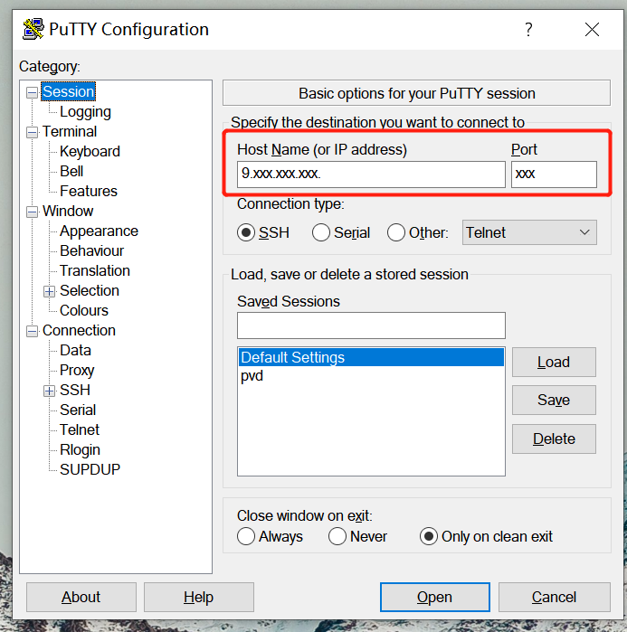
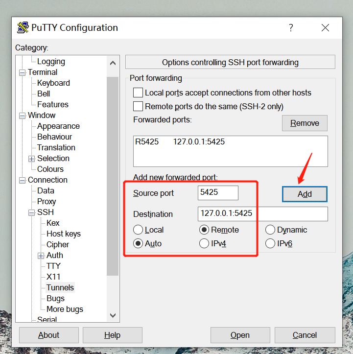
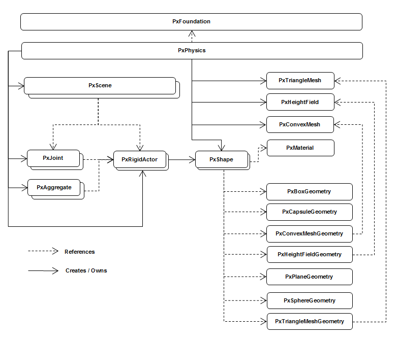

## PhysX 入门

## 目录
* [简介](#简介)
* [编译](#编译)
* [pvd](#pvd)
* [基本原理](#基本原理)

---

## 简介

Physx 官网：https://developer.nvidia.com/physx-sdk

Physx Github：https://github.com/NVIDIAGameWorks/PhysX

PVD 下载地址：https://developer.nvidia.com/physx-visual-debugger

Physx API文档: physx/documentation/PhysXGuide/Manual/API.htm

---

## 编译

在linux下搭建px环境

1. nv的github上clone代码到本地，这是4.1的版本。

    前置依赖是cmake 3.11以上的版本 和 python ，clang yum install clang
    ```
    # 下载
    git clone https://github.com/NVIDIAGameWorks/PhysX .

    # 构建
    cd physx
    ./generate_projects.sh
    输入数字，选择对应的linux版本

    # 分别进入以下两个目录，编译对应的版本
    cd physx/compiler/linux-checked
    cd physx/compiler/linux-relase
    执行make

    # 遇到些额外的问题，找不到x11，手动安装下
    sudo yum install libX11-devel 
    ```

2. 查看编译后的产物
    ```
    physx/bin/linux.clang/release$  ll
    -rw-rw-r-- 1     298K Sep 29 11:33 libPhysXCharacterKinematic_static_64.a
    -rw-rw-r-- 1     3.9M Sep 29 11:32 libPhysXCommon_static_64.a
    -rw-rw-r-- 1     531K Sep 29 11:34 libPhysXCooking_static_64.a
    -rw-rw-r-- 1     2.9M Sep 29 11:34 libPhysXExtensions_static_64.a
    -rw-rw-r-- 1     140K Sep 29 11:32 libPhysXFoundation_static_64.a
    -rw-rw-r-- 1      22M Sep 29 10:55 libPhysXGpu_64.so
    -rw-rw-r-- 1     548K Sep 29 11:33 libPhysXPvdSDK_static_64.a
    -rw-rw-r-- 1     6.9M Sep 29 11:33 libPhysX_static_64.a
    -rw-rw-r-- 1     1.3M Sep 29 11:34 libPhysXVehicle_static_64.a
    -rw-rw-r-- 1     590K Sep 29 11:38 libSampleBase_static_64.a
    -rw-rw-r-- 1     252K Sep 29 11:38 libSampleFramework_static_64.a
    -rw-rw-r-- 1      28K Sep 29 11:37 libSamplesToolkit_static_64.a
    -rw-rw-r-- 1      30K Sep 29 11:34 libSnippetRender_static_64.a
    -rw-rw-r-- 1      17K Sep 29 11:34 libSnippetUtils_static_64.a
    ```

    ```
    ~physx/bin/linux.clang/checked$ ll
    -rw-rw-r-- 1       2.1M Sep 29 11:47 libPhysXCharacterKinematic_static_64.a
    -rw-rw-r-- 1        31M Sep 29 11:46 libPhysXCommon_static_64.a
    -rw-rw-r-- 1       3.1M Sep 29 11:48 libPhysXCooking_static_64.a
    -rw-rw-r-- 1        25M Sep 29 11:47 libPhysXExtensions_static_64.a
    -rw-rw-r-- 1       709K Sep 29 11:45 libPhysXFoundation_static_64.a
    -rw-rw-r-- 1        15M Sep 29 10:55 libPhysXGpu_64.so
    -rw-rw-r-- 1       3.5M Sep 29 11:46 libPhysXPvdSDK_static_64.a
    -rw-rw-r-- 1        84M Sep 29 11:47 libPhysX_static_64.a
    -rw-rw-r-- 1        12M Sep 29 11:48 libPhysXVehicle_static_64.a
    -rw-rw-r-- 1       4.5M Sep 29 11:49 libSampleBase_static_64.a
    -rw-rw-r-- 1       1.8M Sep 29 11:49 libSampleFramework_static_64.a
    -rw-rw-r-- 1       171K Sep 29 11:49 libSamplesToolkit_static_64.a
    -rw-rw-r-- 1       188K Sep 29 11:48 libSnippetRender_static_64.a
    -rw-rw-r-- 1        58K Sep 29 11:48 libSnippetUtils_static_64.a
    ```

3. 编译出一个可运行的程序
    physx/snippets/snippethelloworld 在这里路径下，找到示例文件 SnippetHelloWorld.cpp

    改动如下：
    ```
    -int snippetMain(int, const char*const*)
    +int main(int, const char*const*)
    ```

    Makefile 修改如下：
    ```
    BINARY = $(patsubst %.cpp,%,$(wildcard *.cpp))

    SRC_BASE=../../..

    PHYSX_ROOT=$(SRC_BASE)
    PHYSX_BASE=$(PHYSX_ROOT)/physx

    PHYSX_INC = $(foreach dir, $(shell find $(PHYSX_BASE)/include -type d), -isystem$(dir))
    PHYSX_INC += $(foreach dir, $(shell find $(PHYSX_ROOT)/pxshared/include -type d), -isystem$(dir))

    CINC += $(PHYSX_INC)
    CINC += -isystem$(PHYSX_ROOT)/pxshared/include
    CINC += -isystem$(PHYSX_BASE)/source/geomutils/src
    CINC += -isystem$(PHYSX_BASE)/source/geomutils/src/hf
    CINC += -isystem$(PHYSX_BASE)/source/foundation/include
    CINC += -isystem$(PHYSX_BASE)/source/common/src

    #ifdef SUPPORT_PVD
    PHYSX_LIB=$(PHYSX_BASE)/bin/linux.clang/checked
    #else
    #PHYSX_LIB=$(PHYSX_BASE)/bin/linux.clang/release
    #endif

    LIBS += -L$(PHYSX_LIB)
    #LIBS += -lPhysXGpu_64
    LIBS += $(PHYSX_LIB)/libPhysXCooking_static_64.a
    LIBS += $(PHYSX_LIB)/libPhysXExtensions_static_64.a
    LIBS += $(PHYSX_LIB)/libPhysXFoundation_static_64.a
    LIBS += $(PHYSX_LIB)/libPhysXPvdSDK_static_64.a
    LIBS += $(PHYSX_LIB)/libPhysXCharacterKinematic_static_64.a
    LIBS += $(PHYSX_LIB)/libPhysXVehicle_static_64.a
    LIBS += $(PHYSX_LIB)/libPhysX_static_64.a
    LIBS += $(PHYSX_LIB)/libPhysXCommon_static_64.a
    LIBS += $(PHYSX_LIB)/libPhysXPvdSDK_static_64.a
    LIBS += $(PHYSX_LIB)/libPhysXFoundation_static_64.a

    DEBUG_FLAG=-g -Werror -Wall -fPIC -fno-strict-aliasing -lpthread -ldl -rdynamic -D NDEBUG -D PX_SUPPORT_PVD


    all:SnippetHelloWorld.cpp
            g++ SnippetHelloWorld.cpp -o test0 $(DEBUG_FLAG) $(CINC) $(LIBS)
    ```

    运行：
    ```
    ./test0   
    SnippetHelloWorld done.
    ```

----

## Pvd调试工具

在linux下执行px程序，在window下使用pvd查看或调试。

首先，在官方下载pvd，下载地址：https://developer.nvidia.com/physx-visual-debugger

在linux下编译px程序，注意这里不要使用relase版本编译，release是不支持使用pvd的，可以使用checked或者debug版本编译。

px的程序中，需要添加连接pvd的代码。这样程序允许的时候，linux下的程序会尝试连接pvd。不过由于pvd是运行在window的机器上，不在同一台机器上，需要配置隧道转发。

```
gPvd = PxCreatePvd(*gFoundation);
PxPvdTransport* transport = PxDefaultPvdSocketTransportCreate("127.0.0.1", 5425, 10);
gPvd->connect(*transport,PxPvdInstrumentationFlag::eALL);
```

* linux运行px程序，在win下使用pvd。如何搭建隧道？

下载putty





完成后，在linux输入telnet测试
```
telnet 127.0.0.1 5425     
```

----

## 基本概念

* PhysX世界包含多个scene，每个场景包含多个Actor。

    Acotr主要有三种类型：Rigid Body（刚体）、Particles（粒子，如：流水）、Cloth（布料）

    PhysX内置的Shape：—— 同一actor内的shape可以互相嵌入。

    基础几何体：
    
    * PxBoxGeometry（盒子）

    * PxSphereGeometry（球体）

    * PxCapsuleGeometry（胶囊体）

    * PxPlaneGeometry（平面）

    复杂几何体：
    
    * PxConvexMeshGeometry、PxTriangleMeshGeometry（网格，凸面体 和 三角面）

    * PxHeightFieldGeometry（高度场，如：水面和地形）

    Actor类型：

    * 静态static

    * 动力dynamic

    * 运动kinematic

    Kinematic Actors会推开普通的Dynamic Actors，但是不会受到反作用力。

    Kinematic Actors之间或者Kinematic Actors与Static Actors之间没有相互作用和碰撞。

---

* 碰撞（collision）是整个物理引擎的基础和核心。

    原理：刚体不能嵌入。

    方法：先让碰撞/嵌入发生，然后再修复。

    碰撞检测（detection）是整个引擎的基础。

    分为宽泛阶段(broad phase)和精细阶段(narrow phase)

    碰撞求解（solve）是引擎的一个核心工作。

    引擎主要由simulate（模拟）驱动。

    应用主要由query（查询）驱动。业务的大部分逻辑都是根据查询（及simulate回调）驱动游戏逻辑。

    我们需要知道模拟之后特定空间内、方向上的shape信息。
    需要将所有元素按照特定关系组织起来以便快速查询。数据库使用B+树，物理引擎使用八叉树/二叉树等。

---

* 场景查询SceneQuery类型: 
    
    raycast（射线）、sweep（扫掠）、overlap（重叠）—— 基于查询树(AABBTree)
    
    角色控制CCT(Charactor ConTroller)基于SceneQuery。
    
    载具Vehicle基于joint和SceneQuery。

---

* 代码设计：

    

----

* 参考

    Physx 官网：https://developer.nvidia.com/physx-sdk

    Physx Github：https://github.com/NVIDIAGameWorks/PhysX

    PVD 下载地址：https://developer.nvidia.com/physx-visual-debugger

    Physx的多线程框架解析 - 志创大侠的文章 - 知乎
https://zhuanlan.zhihu.com/p/60733992

    https://github.com/ThisisGame/cpp-game-engine-book

      >  https://github.com/ThisisGame/cpp-game-engine-book/blob/main/pages/22.%20physics_engine_physx/22.1%20hello_physx.md