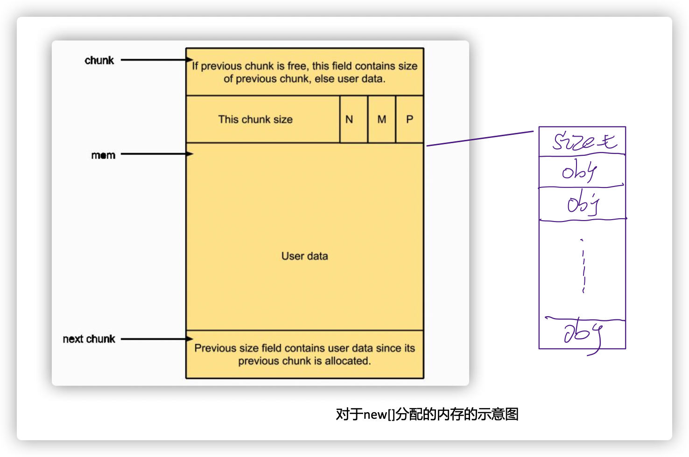

# c++ 的内存管理


### new和delete

* new 和 delete 做了什么？

    new:
    ```
    1. 申请内存
        new -> operator new -> malloc -> linux系统分配内存

    2. 在内存上调用构造函数，构造对象
    ```

    delete：
    ```
    1. 析构函数
    2. 释放对象
    ```

    new申请的内存来自于什么地方？
    ```
    ```

* new[] 和 delete[] 和 new ，delete的区别?

    **先把结论写在前面**，后面的问题就好理解了

    * new/malloc 会记录分配的内存的长度，delete/free 的时候无需指定长度，只要传入首地址即可。

    * 对于有 non-trivial destructor 的 class T, 现在通常的 C++ 实现会在 new[] 的时候多分配 sizeof(size_t) 字节用于保存数组大小，在 delete[] 的时候会依次逆序调用数组中各对象的析构函数。有的文献管这多分配的几个字节叫 new cookie (Itanium C++ ABI)。
    

    1. 为什么申请内存的时候，需要带上size，而释放内存的时候不需要？

        在malloc申请内存的时候，在返回的指针上面会携带一个cookie的信息，信息中携带了内存这块内存的大小。所以，释放的时候，并不需要携带size。因为根据要释放内存的指针，就可以找到对应cookie信息，然后释放这块内存。

        

        https://www.zhihu.com/question/302440083

    2. new[]申请的内存和new的行为是一样的吗？

        不一样，对于是new[]的的情况，会多申请一个size_t的内存，用来存储申请的数量。
        
        
        
        示例代码如下：
        ```
        // 用于分配内存的函数
        void* operator new(std::size_t size)
        {
            void* block = std::malloc(size);
            if (block == nullptr) {
                throw std::bad_alloc();
            }
            return block;
        }

        void* operator new[](std::size_t size)
        {
            void* block = std::malloc(size);
            if (block == nullptr) {
                throw std::bad_alloc();
            }
            return block;
        }

        // 用于释放内存的函数
        void operator delete(void* block) noexcept
        {
            std::free(block);
        }

        void operator delete[](void* block) noexcept
        {
            std::free(block);
        }

        // new T(args...)
        template <typename T, typename... Args>
        T* new_op(Args&&... args)
        {
            void* block = operator new(sizeof(T));
            // 在 block 这块内存上原地调用构造函数
            return new(block) T(std::forward<Args>(args)...);
        }

        // new T[size]()
        template <typename T>
        T* new_array_op(std::size_t size)
        {
            if constexpr (std::is_trivially_destructible_v<T>) {
                // 可平凡析构，无需记录大小。
                void* block = operator new[](sizeof(T) * size);
                T* p = reinterpret_cast<T*>(block);
                // 依次调用默认构造函数。
                for (std::size_t i = 0; i < size; ++i) {
                    new(p + i) T();
                }
                return p;
            } else {
                // 不可平凡析构，需要记录大小。
                void* block = operator new[](sizeof(T) * size + sizeof(size_t));
                *reinterpret_cast<size_t*>(block) = size;
                T* p = reinterpret_cast<T*>(
                        reinterpret_cast<char*>(block) + sizeof(size_t));
                // 依次调用默认构造函数。
                for (std::size_t i = 0; i < size; ++i) {
                    new(p + i) T();
                }
                return p;
            }
        }

        // delete ptr
        template <typename T>
        void delete_op(T* ptr) noexcept(std::is_nothrow_destructible_v<T>)
        {
            if (ptr != nullptr) {
                ptr->~T();
                operator delete(ptr);
            }
        }

        // delete[] ptr
        template <typename T>
        void delete_array_op(T* ptr) noexcept(std::is_nothrow_destructible_v<T>)
        {
            if (ptr == nullptr) {
                return;
            }
            if constexpr (std::is_trivially_destructible_v<T>) {
                // 可平凡析构，直接释放内存。
                operator delete[](ptr);
            } else {
                // 需要先获取数组大小。
                void* block = reinterpret_cast<char*>(ptr) - sizeof(size_t);
                size_t size = *reinterpret_cast<const size_t*>(block);
                // 然后依次调用析构函数。
                for (std::size_t i = 0; i < size; ++i) {
                    (ptr + i)->~T();
                }
                // 最后释放内存。
                operator delete[](block);
            }
        }
        ```

    3. 如果申请内存内存和释放的new和delete不匹配，会怎么样？

        分为两种情况，比如class T 没有析构函数（或者class T 是内置的成员变量）那么，使用错误没有太大印象。

        如果class T有析构函数，那程序会coredump掉。
        ```
        class inner 
        {
        public:
            inner() { cout << "inner Constructing " << hex << this << endl; }
            ~inner() { cout << "inner Destructing" << endl; }
        private:
            int val;
        };

        class normal
        {
        public:
            normal() { cout << "normal Constructing " << hex << this << endl; }
        private:
            int val;    
        };

        int main(int argc, char *argv[]) 
        {
            inner *  pa = new inner[2];
            normal * pb = new normal[2];
            int * pc = new int[2];

            delete pc;
            delete pb;   
            delete pa;  // coredump heres
            return 0;
        }

        /a.out 
        inner Constructing 0x210ceb8
        inner Constructing 0x210cebc
        normal Constructing 0x210d2e0
        normal Constructing 0x210d2e4
        inner Destructing
        munmap_chunk(): invalid pointer
        Aborted (core dumped)
        ```

* new 和 delete的重载

    operator new 和 opertor delete 分为两种重载，分别是全局的重载和类内部的重载。

    其他的部分整理在这里：

    https://www.jianshu.com/p/27e2a80a158c

* placement new

    ```
    class TEST
    {
    private:
        int val;
    public:
        TEST(int value)
        {
            this->val = value;
        }
        void print()
        {
            cout<<this->val<<endl;
        }
    };

    int main()
    {
        //TEST test[10];   //报错，因为没有默认无参数的的构造参数
        
        
        //使用placement new 
        int val = 998;
        
        // 分配空间
        void * raw_memory = operator new(sizeof(TEST) * 10);
        // 强转指针类型
        TEST * test = static_cast<TEST *>(raw_memory);
        // placement new
        for(int i=0;i<10;i++)
        {
        new(test+i) TEST(val);
        }

        // visit
        for(int i=0;i<10;i++)
        {
            (test+i)->print();
        }

        return 0;
    }
    ```

    * 知识点

        1. 使用operator new 分配一块空间 （约等于malloc）
            ```
            void * raw_memory = operator new(size);
            ```

        2. 使用placement new 完成调用构造函数

            ```
            new (raw_memory) Test();
            ```

* delete 的时候 我觉得这样安全一点

    ```
    delete obj;
    obj = NULL;   # 让指针指空
    ```

* 参考

    1. https://www.zhihu.com/question/406164583/answer/2040289707

    2. new和delete以及new[]和delete[]一定要配对使用吗 - 程序喵大人的文章 - 知乎
https://zhuanlan.zhihu.com/p/144600712

    3. 关于malloc返回值的问题？ - 程序喵大人的回答 - 知乎
https://www.zhihu.com/question/275695474/answer/1648135150

    4. https://wetest.qq.com/lab/view/318.html

    5. 作者：yuantj
       链接：https://www.zhihu.com/question/406164583/answer/2040289707
