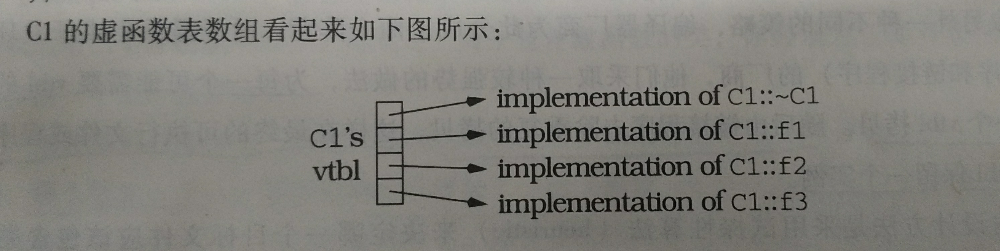
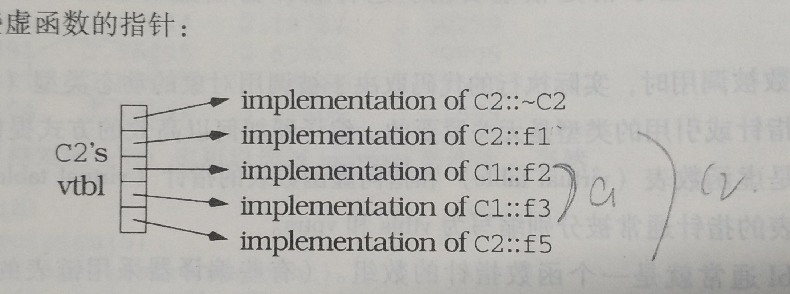

C++ 的多态和虚函数

* is-a 模型

    一个函数的参数是基类的话，那么可以对于这个函数的调用，实参既可以传递基类对象又可以传递子类对象。

    ```
    class base
    {

    };

    class derived:public base
    {

    };

    void test1(base b)
    {
        cout<<"test1"<<endl;
    }

    int main()
    {
        base b;
        derived d;

        test1(b);    //传递的是基类的对象
        test1(d);    //传递的是派生类的对象

        return 0;
    }
    ```

    **这样可能会带来一个问题**
    
    对于下面的代码，编译是可以通过的，但是运行会报错。
    ```
    void test2(base arr_b[],int num)
    {
        for(int i=0;i<num;i++)
        {
            arr_b[i].print();
        }
    }

    int main()
    {
        derived d[10];
        test2(d,10);
        return 0;
    }
    ```
    运行会报错的原因是，对于传递过来的数组,
    ```
    // 编译器对于 arr_b[i] 具体的工作是： 
    arr_b + sizeof(base) * i
    ```

    那么，如果传递过来的是derived的类型，那么就会出问题。因为，每个数组里面的对象的大小，应该是sizeof(derived)。这样程序就会core掉。

    —— from 《more effective c++ 》 条款三 **不要把多态应用于数组**


* 虚函数/虚函数表

    * 什么是虚函数？什么是多态？

        思考一下这段代码，如果什么都联想不起来，那就需要再看一看 c++ primer 这本书了。 
        ```
        base * b = new derived();
        b->print();
        ```

    * 怎么样实现多态和虚函数？

        答案就是虚函数表和虚函数指针。

        ```
        class C1
        {
            public:
                virtual ~C1();
                virtual void f1();
                virtual int f2(char c) const;
                virtual void f3(const string & s);

                void f4();
        };
        ```
        C1的虚函数表 : 

        

        **注意虚函数表里面只有虚函数**

        再来看 派生类C2

        ```
        class C2 : public C1
        {
            public:
            C2();
            virtual ~C2();
            virtual void f1();
            virtual void f5(char * str);
        }
        ```

        这是C2的虚函数表
        


        思考一个问题：
        ```
        void makeCall(C1 * p_c1)
        {
            p_c1->f1();
        }
        ```

        只看这段代码，其实是不知道会执行的是C1::f1 , 还是 C2::f2 。因为不知道p_c1指向的是那个基类对象还是派生类的对象。

        那么，在运行的时候，怎么知道调用那个函数？

        1. 找到p_c1指向的虚函数指针。（一般在对象的头部）

        2. 根据虚函数指针找到虚函数表，从虚函数表里面找到f1函数。

        3. 然后执行这个函数。


* 使用虚函数的代价

    * 每个对象的大小会变大 ，多了一个指针的大小

    * 每个类会多一张虚函数表

        （这个虚函数表会存放在哪里？）

        《more effective c++ 》 条款24 p86页

    * 执行虚函数的时候，需要查表（效率上会慢一点）