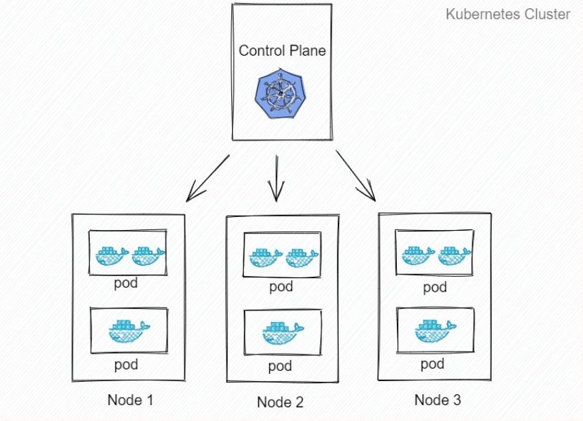

# docker 入门

## 目录

---
## docker简介

### docker简介和优点

### docker的几个概念

* 镜像（image）

* 容器（container）

    镜像（Image）和容器（Container）的关系，**就像是面向对象程序设计中的 类 和 实例 一样，镜像是静态的定义，容器是镜像运行时的实体。**容器可以被创建、启动、停止、删除、暂停等。


    前面讲过镜像使用的是分层存储，容器也是如此。**每一个容器运行时，是以镜像为基础层，在其上创建一个当前容器的存储层，我们可以称这个为容器运行时读写而准备的存储层为容器存储层。**

* 仓库（repository）

---

## 基本使用

### 1. 获取镜像

Docker Hub 上有大量的高质量的镜像可以用，这里我们就说一下怎么获取这些镜像。

从 Docker 镜像仓库获取镜像的命令是 docker pull。其命令格式为：
```
docker pull [选项] [Docker Registry 地址[:端口号]/]仓库名[:标签]
```

具体的选项可以通过 docker pull --help 命令看到，这里我们说一下镜像名称的格式。

* Docker 镜像仓库地址：地址的格式一般是 <域名/IP>[:端口号]。默认地址是 Docker Hub。
* 仓库名：如之前所说，这里的仓库名是两段式名称，即 <用户名>/<软件名>。对于 Docker Hub，如果不给出用户名，则默认为 library，也就是官方镜像。

---

### 2. 运行

* 查看
```
docker image ls

docker ps

docker ps -a

docker stats
```

* pull
```
docker pull ubuntu:16.04
```

* run 
```
docker run -it --rm ubuntu:16.04 bash

-it：这是两个参数，一个是 -i：交互式操作，一个是 -t 终端。
我们这里打算进入 bash 执行一些命令并查看返回结果，因此我们需要交互式终端。

--rm：这个参数是说容器退出后随之将其删除。
默认情况下，为了排障需求，退出的容器并不会立即删除，除非手动 docker rm。
我们这里只是随便执行个命令，看看结果，不需要排障和保留结果，因此使用 --rm 可以避免浪费空间。

ubuntu:16.04：这是指用 ubuntu:16.04 镜像为基础来启动容器。

bash：放在镜像名后的是命令，这里我们希望有个交互式 Shell，因此用的是 bash
```

* 启动/重新启动某一个容器
```
docker stop/restart [name]
```

* 例子

安装和运行nginx
```
C:\Users\wwwa8>docker image ls
REPOSITORY          TAG                 IMAGE ID            CREATED             SIZE
bitnami/php-fpm     latest              959ab149486d        4 hours ago         244MB
nginx               latest              568c4670fa80        3 days ago          109MB
ubuntu              16.04               a51debf7e1eb        11 days ago         116MB


# 运行
docker run -d --name=my_nginx -p 8888:80 nginx

# 查看
docker ps
CONTAINER ID        IMAGE               COMMAND                  CREATED             STATUS              PORTS                  NAMES
13380cc93176        nginx               "nginx -g 'daemon of…"   2 minutes ago       Up 2 minutes        0.0.0.0:8888->80/tcp   my_nginx
dd5b26affce3        nginx               "bash"                   26 minutes ago      Up 26 minutes       80/tcp                 vibrant_clarke

# 可以从本地的浏览器的8888端口看一下nginx的服务


# 进入nginx内部
docker exec -it my_nginx bash
```

------

### 例子
```
# 运行一个redis镜像
sudo docker run -d -p 6379:6379 --name redis redis:latest

# 关闭容器
docker stop container-id  

# 查看名字
docker images
REPOSITORY   TAG       IMAGE ID       CREATED       SIZE
redis        latest    2f66aad5324a   12 days ago   117MB

# 启动
docker start redis

# 进入容器
docker exec -it redis /bin/bash
docker exec -it <容器ID> /bin/bash

# 执行redis客户端
redis-cli
127.0.0.1:6379> 

```
```
# 查看
docker ps 查看当前运行中的容器
docker images 查看镜像列表
docker rm container-id 删除指定 id 的容器
docker stop/start container-id 停止/启动指定 id 的容器
docker rmi image-id 删除指定 id 的镜像
docker volume ls 查看 volume 列表
docker network ls 查看网络列表
```

* 交互式
```
docker run -i -t ubuntu:15.10 /bin/bash

各个参数解析：
-t: 在新容器内指定一个伪终端或终端。
-i: 允许你对容器内的标准输入 (STDIN) 进行交互。
```

* 查看日志
```
#  启动一个docker
docker run -d ubuntu:15.10 /bin/sh -c "while true; do echo hello world; sleep 1; done"
 
# 查看日志
docker logs <容器ID>
docker logs -f  <容器ID>
```

* 查看网络端口映射
```
docker port <容器ID>
```

* top查看
```
docker top <容器ID>
UID                 PID                 PPID                C                   STIME               TTY                 TIME                CMD
root                5695                30047               0                   19:23               ?                   00:00:00            sleep 1
root                30047               30025               0                   18:59               ?                   00:00:00            /bin/sh -c while true; do echo hello world; sleep 1; done
```

* 镜像
```
$ docker pull hello-world
Using default tag: latest
latest: Pulling from library/hello-world
2db29710123e: Pull complete 
Digest: sha256:6e8b6f026e0b9c419ea0fd02d3905dd0952ad1feea67543f525c73a0a790fefb
Status: Downloaded newer image for hello-world:latest
docker.io/library/hello-world:latest

$ docker images
REPOSITORY    TAG       IMAGE ID       CREATED         SIZE
redis         latest    2f66aad5324a   12 days ago     117MB
hello-world   latest    feb5d9fea6a5   17 months ago   13.3kB
ubuntu        15.10     9b9cb95443b5   6 years ago     137MB

# 运行
$ docker run hello-world

# 删除
$ docker rmi hello-world
```

----

### Dockerfile
在dockerfile所在的目录执行docker build命令，构建自己的docker镜像。
```
docker build -t test:v1 .
-t 设置镜像名字和版本号 // 这里指的是镜像名称是test，版本是v1
```

### 目录挂载
* bind mount 直接把宿主机目录映射到容器内，适合挂代码目录和配置文件。可挂到多个容器上
* volume 由容器创建和管理，创建在宿主机，所以删除容器不会丢失，官方推荐，更高效，Linux 文件系统，适合存储数据库数据。可挂到多个容器上
* tmpfs mount 适合存储临时文件，存宿主机内存中。不可多容器共享。
```
docker run -p 8080:8080 --name test-hello -v D:/code:/app -d test:v1
```

### 虚拟网络--多容器通信
```
# 创建一个名为test-net的网络
docker network create test-net

# 运行 Redis 在 test-net 网络中，别名redis
docker run -d --name redis --network test-net --network-alias redis redis:latest
```

### Docker-Compose
* docker-compose 把项目的多个服务集合到一起，一键运行
* 在docker-compose.yml 文件所在目录，执行：docker-compose up就可以跑起来了

```
在后台运行只需要加一个 -d 参数docker-compose up -d
查看运行状态：docker-compose ps
停止运行：docker-compose stop
重启：docker-compose restart
重启单个服务：docker-compose restart service-name
进入容器命令行：docker-compose exec service-name sh
查看容器运行log：docker-compose logs [service-name]
```

---

#### kubernetes
k8s可以干什么？
* 当你的应用只是跑在一台机器，直接一个 docker + docker-compose 就够了，方便轻松；
* 当你的应用需要跑在 3，4 台机器上，你依旧可以每台机器单独配置运行环境 + 负载均衡器；
* 当你应用访问数不断增加，机器逐渐增加到十几台、上百台、上千台时，每次加机器、软件更新、版本回滚，都会变得非常麻烦。这时候Kubernetes 就可以一展身手了。



pdd是k8s调度、管理的最小单位，一个 Pod 可以包含一个或多个容器，每个 Pod 有自己的虚拟IP。一个工作节点可以有多个 pod，主节点会考量负载自动调度 pod 到哪个节点运行。

#### 安装
```
curl -LO https://storage.googleapis.com/minikube/releases/latest/minikube-linux-amd64
sudo install minikube-linux-amd64 /usr/local/bin/minikube
```

```
minikube start --force --driver=docker

minikube kubectl

minikube kubectl -- get pods -A
```


* 工作负载分类
   * Deployment
适合无状态应用，所有pod等价，可替代
  * StatefulSet
有状态的应用，适合数据库这种类型。
  * DaemonSet
在每个节点上跑一个 Pod，可以用来做节点监控、节点日志收集等
  * Job & CronJob
Job 用来表达的是一次性的任务，而 CronJob 会根据其时间规划反复运行。


----

## 参考

- [docker 入门到实践](https://yeasy.gitbooks.io/docker_practice/image/pull.html)

- [使用Docker快速搭建Nginx+PHP-FPM环境](https://www.jianshu.com/p/3384e342502b)

- [docker 教程](https://docker.easydoc.net/doc/81170005/cCewZWoN/XQEqNjiu)

- [k8s 教程](https://k8s.easydoc.net/docs/dRiQjyTY/28366845/6GiNOzyZ/9EX8Cp45)