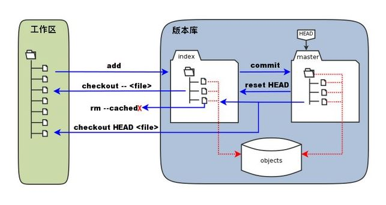
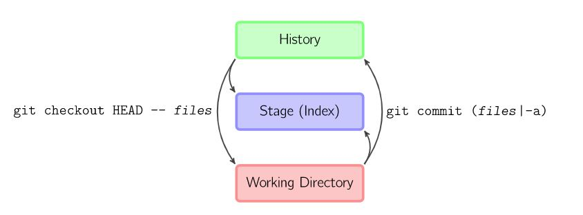

# Git 

## Git VS SVN

1. Git 属于分布式版本控制系统，而 SVN 属于集中式。


2. 集中式版本控制只有中心服务器拥有一份代码，而分布式版本控制每个人的电脑上就有一份完整的代码。

3. 集中式版本控制有安全性问题，当中心服务器挂了所有人都没办法工作了。

4. 集中式版本控制需要连网才能工作，如果网速过慢，那么提交一个文件的会慢的无法让人忍受。而分布式版本控制不需要连网就能工作。

5. 分布式版本控制新建分支、合并分支操作速度非常快，而集中式版本控制新建一个分支相当于复制一份完整代码。

6. 中心服务器用来交换每个用户的修改，没有中心服务器也能工作，但是中心服务器能够 24 小时保持开机状态，这样就能更方便的交换修改。**Github 就是一个中心服务器。**

## Git

Git 里面又三个概念：分别是工作区，暂存区，和版本库。

1. 工作区：就是你在电脑里能看到的目录。

2. 暂存区：英文叫stage, 或index。一般存放在 ".git目录下" 下的index文件（.git/index）中，所以我们把暂存区有时也叫作索引（index）。

3. 版本库：工作区有一个隐藏目录.git，这个不算工作区，而是Git的版本库。


下面这个图展示了工作区、版本库中的暂存区和版本库之间的关系：



---

* 图中左侧为工作区，右侧为版本库。在版本库中标记为 "index" 的区域是暂存区（stage, index），标记为 "master" 的是 master 分支所代表的目录树。图中我们可以看出此时 "HEAD" 实际是指向 master 分支的一个"游标"。所以图示的命令中出现 HEAD 的地方可以用 master 来替换。图中的 objects 标识的区域为 Git 的对象库，实际位于 ".git/objects" 目录下，里面包含了创建的各种对象及内容。

* 当对工作区修改（或新增）的文件执行 "git add" 命令时，暂存区的目录树被更新，同时工作区修改（或新增）的文件内容被写入到对象库中的一个新的对象中，而该对象的ID被记录在暂存区的文件索引中。

* 当执行提交操作（git commit）时，暂存区的目录树写到版本库（对象库）中，master 分支会做相应的更新。即 master 指向的目录树就是提交时暂存区的目录树。

* 当执行 "git reset HEAD 或 commit_id " "git reset -- \<file> "命令时，暂存区的目录树会被重写，被 master 分支指向的目录树所替换，但是工作区不受影响。（git reset HEAD 命令用于取消已缓存的内容）

* 当执行 "git rm --cached \<file> " 命令时，会直接从暂存区删除文件，工作区则不做出改变。

* 当执行 "git checkout ." 或者 "git checkout -- \<file>" 命令时，会用暂存区全部或指定的文件替换工作区的文件。这个操作很危险，会清除工作区中未添加到暂存区的改动。

* 当执行 "git checkout HEAD . 或 git checkoout commit_id .  " 或者 "git checkout HEAD \<file>" 命令时，会用 HEAD 指向的 master 分支中的全部或者部分文件替换暂存区和以及工作区中的文件。这个命令也是极具危险性的，因为不但会清除工作区中未提交的改动，也会清除暂存区中未提交的改动。

---


比如现在有一个文件 test.txt 
```
git add test.txt          把文件的修改添加到暂存区
git commit -m 'add'       把暂存区的修改提交到当前分支，提交之后暂存区就被清空了
git reset -- test.txt     使用当前分支上的修改覆盖暂存区，用来撤销最后一次 git add files
git checkout -- test.txt  使用暂存区的修改覆盖工作目录，用来撤销本地修改
```



可以跳过暂存区域直接从分支中取出修改，或者直接提交修改到分支中。

git commit -a 直接把所有文件的修改添加到暂存区然后执行提交。

git checkout HEAD -- files 取出最后一次修改，可以用来进行回滚操作。


```
# 如果不是很清楚，文件的修改是否从工作区 add 到了暂存区，还是已经commit 到了版本库，
# 可以使用 git status 命令
# 如果已经 commit，那么显示：
git status
位于分支 master
无文件要提交，干净的工作区
```


撒销一个合并
```
# 如果你觉得你合并后的状态是一团乱麻，想把当前的修改都放弃，你可以用下面的命令回到合并之前的状态
git reset --hard HEAD
git reset --hard commit_id
```

## 查看
```
git status
git status -s
git log
git log --stat
```


## 分支管理

查看分支：
```
git branch
  dev
* master
```

创建分支：
```
git branch dev
```

切换分支：
```
git checkout dev
```

创建并且切换分支：
```
git checkout -b dev
```

合并分支：

```
# 如果要在master分支合并dev分支，那么在切换到master的分支之后，就可以合并dev分支
git merge dev
```

删除分支：
```
git branch -d (branchname)
```

## git diff

用git diff来找你当前工作目录和上次提交与本地索引间的差异。
```
git diff
```

## .gitignore

首先，在你的工作区新建一个名称为.gitignore的文件。
**然后，把要忽略的文件名填进去，Git就会自动忽略这些文件。**

不需要从头写.gitignore文件，GitHub已经为我们准备了各种配置文件，只需要组合一下就可以使用了。
所有配置文件可以直接在线浏览：https://github.com/github/gitignore

比如说，不想把a.out文件加入git,那么在.gitignore的文件里面的内容是：
```
*.o
*.out
```

## git的工具
```
# 很漂亮的图形的显示项目的历史
gitk
```

## 参考

- [廖雪峰教程](https://www.liaoxuefeng.com/wiki/0013739516305929606dd18361248578c67b8067c8c017b000)

- [cyc_git教程](https://github.com/CyC2018/CS-Notes/blob/master/docs/notes/Git.md)

- [runoob教程](http://www.runoob.com/git/git-workspace-index-repo.html)

- [具体的每一个git命令的使用](https://www.yiibai.com/git/git_diff.html)

  https://gist.github.com/285571052/72fe4e85290d170b9de4634b6ad8c082

  https://git-scm.com/book/zh/v2

- [关于远程仓库](https://www.jianshu.com/p/9685a56bdf7a)

更新一部分：


### 分支管理

merge表示的合并某一个分支到当前分支，**但是如果有冲突的话，需要收到解决冲突。**

|命令|内容|
|:---:|:---:|
|git merge dev  | #在当前分支和并dev分支|
|git checkout -b [branch-name]| 创建分支并且切换到这个分支|
|git branch -d [branch-name]|删除分支|


### reset命令

reset 一般指的是将版本库的内容撤回到暂存区。
但是，也可以加上--hard 之后，将版本库的内容直接撤回到workspace里面。


| 命令 |  内容  |
|:---:|:---:|
|git reset -- test.txt    | 使用当前版本仓库里面的内容覆盖暂存区，用来覆盖最git add的内容| 
|git reset —hard [commit]	| 暂存区、工作区的内容都会被修改到与提交点完全一致的状态 |
|git reset --hard HEAD	|让工作区回到上次提交时的状态|
|git reset —soft [commit]|	只改变提交点，暂存区和工作目录的内容都不改变|


## checkout


## diff 

| 命令 |  内容  |
|:---:|:---:|
|git diff | 显示暂存区和工作区的差异|
|git diff [file-name]|显示某一个文件，暂存区和工作区的差异|
|git diff HEAD|显示工作区与当前分支最新commit之间的差异|


## fetch 