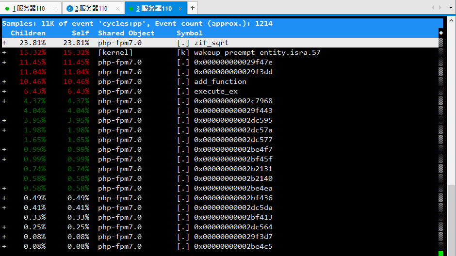

# Linux 命令

## 目录

* [Linux 基础](#Linux基础)

* [Linux 工具命令](#Linux工具命令)

    * [GDB](#GDB)

    * [MAKE](#MAKE)

    * [CMAKE](#CMAKE)

    * [GCC/G++](#GCC/G++)

    * [vim](#vim)

* [Linux 进阶](#linux进阶)

    * [htop/top](#htop/top)

    * [strace](#strace)

    * [vmstat](#vmstat)

    * [pidstat](#pidstat)

    * [mpstat](#mpstat)

    * [perf](#perf)


* [Linux 性能优化](#linux性能优化)


* [参考资料](#参考资料)

---

## Linux基础

* which 命令

    which + 可执行文件 ，用来查找它的路径和存放的地方。
    ```
    which python
    /usr/bin/python
    ```

* time 命令

    统计一个命令或者可执行文件执行的时间。

    time a.out 
    ```
    real	0m2.753s
    user	0m0.000s
    sys	0m0.000s
    ```

* tcpdump 命令

    [tcpdump命令](https://github.com/zhaozhengcoder/CoderNoteBook/blob/master/note/linux%E5%91%BD%E4%BB%A4_tcpdump.md)

*  ps 命令

    ```
    ps -aux         # 我常用的
    ps -T -p pid    # ps查看线程
    ```

* find 命令

    经常的需求就是，比如说要寻找home目录下面某个文件或文件夹。
    
    find <指定目录> <指定条件> <指定动作>
    ```
    $find . -name 'my*'          # 查找当前目录下面的，名字前缀是my开头的文件或文件夹
    $find . -name 'my*'   -ls    # 搜索当前目录中，所有文件名以my开头的文件，并显示它们的详细信息。
    $find . -name '*.cpp' -ls    # 搜索当前目录中，以cpp结尾的文件，并显示它们的详细信息。
    ```

    **但是，find有一个问题就在文件比较多的时候，很慢。**
    这个时候locate命令就会更好一点了。

    ```
    locate ~/code/*.cpp          # 查找~/code目录下面 以cpp结尾的文件
    ```

* grep 命令

    查找当前文件夹下面，包含iostream字符串的文件。
    ```
    grep -rn "iostream"
    ```
* sz / rz 命令

    sz 从服务器上面下载一个文件

    rz 上传一个文件给服务器

    **这个命令很适合使用xshell或crt的人，真的很方便。**

* scp 命令

## Linux工具命令

### GDB

* GDB 调试
    ```
    run + 参数  #开始
    break      #断点

    next      #下一行
    step      #单步进入
    continue  #跳到下一个断点

    bt        #查看函数栈
    ```
* attach
    ```
    gdb attach 进程号
    ```

* 处理corefile
    ```
    gdb a.out core.xxxx
    ```

* 调试多进程

    方式1：
    ```
    gdb attach 进程号
    ```

    方式2：使用follow-fork-mode
    ```
    (gdb) set follow-fork-mode child   # 表示调试子进程
    (gdb) set follow-fork-mode parent  # 表示调试子进程
    ```

* 调试多线程
    
    ```
    info threads              # 查看线程信息
    set scheduler-locking on  # 锁定线程
    thread 2                  # 选择要调试的线程
    ```

* 推荐一个教程

    https://wizardforcel.gitbooks.io/100-gdb-tips/content/ 

### make

- [make](https://github.com/zhaozhengcoder/CoderNoteBook/blob/master/note/linux%E5%91%BD%E4%BB%A4_make%E6%95%99%E7%A8%8B.md)


### cmake

- [cmake]()

### GCC/G++

常用的参数
```
-c          # 生成 .o 目标文件 ， 不进行连接操作
-s          # 生成汇编代码               gcc -S test.i -o test.s
-E          # 预处理                    gcc -E test.c -o test.i
-Wall       # 显示警告信息
-Werror     # error的时候，停止编译
-lpthread


-I          # 指定头文件搜索的目录
            gcc –c –I /usr/dev/mysql/include test.c –o test.o

-L          #-L -l  指定了链接静态库或者是动态库的路径
-l          
            gcc –L /usr/dev/mysql/lib –lmysqlclient test.o –o test
```

```
静态库链接时搜索路径顺序：

1. ld会去找GCC命令中的参数-L
2. 再找gcc的环境变量LIBRARY_PATH
3. 再找内定目录 /lib /usr/lib /usr/local/lib 这是当初compile gcc时写在程序内的

动态链接时、执行时搜索路径顺序:

1. 编译目标代码时指定的动态库搜索路径
2. 环境变量LD_LIBRARY_PATH指定的动态库搜索路径
3. 配置文件/etc/ld.so.conf中指定的动态库搜索路径
4. 默认的动态库搜索路径/lib
5. 默认的动态库搜索路径/usr/lib

有关环境变量：
LIBRARY_PATH环境变量：指定程序静态链接库文件搜索路径
LD_LIBRARY_PATH环境变量：指定程序动态链接库文件搜索路径
```

segment fault的时候设置产生core文件
```
ulimit -a    #查看core 是否可以产生

core file size          (blocks, -c) 0
data seg size           (kbytes, -d) unlimited
scheduling priority             (-e) 0
file size               (blocks, -f) unlimited
pending signals                 (-i) 7823
max locked memory       (kbytes, -l) 64
max memory size         (kbytes, -m) unlimited
open files                      (-n) 1024
pipe size            (512 bytes, -p) 8
POSIX message queues     (bytes, -q) 819200
real-time priority              (-r) 0
stack size              (kbytes, -s) 8192
cpu time               (seconds, -t) unlimited
max user processes              (-u) 7823
virtual memory          (kbytes, -v) unlimited
file locks                      (-x) unlimited

```

上面可以看出core file的大小是 0 
```
ulimit -c 1024        # 修改成1024，这样就可以产生core file了
```


## Linux 进阶

### htop/top

top的一部分输出是：
```
    PID USER      PR  NI    VIRT    RES    SHR S  %CPU %MEM     TIME+ COMMAND
1 root      20   0    8304    132    104 S   0.0  0.0   0:00.06 init
3 root      20   0    8304     92     56 S   0.0  0.0   0:00.00 init
```

```
VIRT 的定义是：
    占用的虚拟内存的大小（占用的物理内存+swap空间）
    virt是virtual memory usage ，virt是virtual的前四个字母的缩写吧。
    virt表示的是申请到的内存，而不是使用的内存。（假如进程申请100m的内存，但实际只使用了10m，那么它会增长100m，而不是实际的使用量）

RES  表示的是：占用的物理内存
    进程常驻内存的大小，实际使用的物理内存

SHR  表示的是：占用的是共享内存
```

```
关于cpu利用率中一栏的内容：
1.3% us — 用户空间占用CPU的百分比。
1.0% sy — 内核空间占用CPU的百分比。
0.0% ni — 改变过优先级的进程占用CPU的百分比
97.3% id — 空闲CPU百分比
0.0%  wa — IO等待占用CPU的百分比（wait io）
0.3%  hi — 硬中断（Hardware IRQ）占用CPU的百分比
0.0%  si — 软中断（Software Interrupts）占用CPU的百分比
```

### mpstat
mpstat是Multiprocessor Statistics的缩写，是实时系统监控工具。
```
# 使用
mpstat -P ALL 5 3   # 查看所有的cpu的状态，每个5s输出一次，连续输出三次

# 解释

mpstat [-P {|ALL}] [internal [count]]

-P        {|ALL} 表示监控哪个CPU， cpu在[0,cpu个数-1]中取值
internal  相邻的两次采样的间隔时间、
count     采样的次数，count只能和delay一起使用
```

```
# 对应的输出

11时01分59秒  CPU    %usr   %nice    %sys %iowait    %irq   %soft  %steal  %guest  %gnice   %idle
11时02分04秒  all    0.03    0.00    0.03    0.03    0.00    0.00    0.00    0.00    0.00   99.92
11时02分04秒    0    0.00    0.00    0.00    0.00    0.00    0.00    0.00    0.00    0.00  100.00
11时02分04秒    1    0.00    0.00    0.00    0.00    0.00    0.00    0.00    0.00    0.00  100.00
11时02分04秒    2    0.00    0.00    0.00    0.00    0.00    0.00    0.00    0.00    0.00  100.00
11时02分04秒    3    0.00    0.00    0.00    0.00    0.00    0.00    0.00    0.00    0.00  100.00
11时02分04秒    4    0.00    0.00    0.00    0.00    0.00    0.00    0.00    0.00    0.00  100.00
11时02分04秒    5    0.00    0.00    0.00    0.00    0.00    0.00    0.00    0.00    0.00  100.00
11时02分04秒    6    0.00    0.00    0.00    0.00    0.00    0.00    0.00    0.00    0.00  100.00
11时02分04秒    7    0.00    0.00    0.00    0.00    0.00    0.00    0.00    0.00    0.00  100.00

平均时间:  CPU    %usr   %nice    %sys %iowait    %irq   %soft  %steal  %guest  %gnice   %idle
平均时间:  all    0.02    0.00    0.07    0.02    0.00    0.00    0.00    0.00    0.00   99.90
平均时间:    0    0.00    0.00    0.00    0.00    0.00    0.00    0.00    0.00    0.00  100.00
平均时间:    1    0.00    0.00    0.07    0.13    0.00    0.00    0.00    0.00    0.00   99.80
平均时间:    2    0.00    0.00    0.07    0.00    0.00    0.00    0.00    0.00    0.00   99.93
平均时间:    3    0.00    0.00    0.00    0.00    0.00    0.00    0.00    0.00    0.00  100.00
平均时间:    4    0.00    0.00    0.00    0.00    0.00    0.00    0.00    0.00    0.00  100.00
平均时间:    5    0.00    0.00    0.13    0.00    0.00    0.00    0.00    0.00    0.00   99.87
平均时间:    6    0.07    0.00    0.20    0.00    0.00    0.00    0.00    0.00    0.00   99.73
平均时间:    7    0.00    0.00    0.00    0.00    0.00    0.00    0.00    0.00    0.00  100.00

# 解释
%usr	在internal时间段里，用户态的CPU时间（%）
%nice	在internal时间段里，nice值为负进程的CPU时间（%）
%sys	在internal时间段里，核心时间（%）	
%iowait	在internal时间段里，硬盘IO等待时间（%）
%irq	在internal时间段里，硬中断时间（%）	
%soft	在internal时间段里，软中断时间（%）
%steal	显示虚拟机管理器在服务另一个虚拟处理器时虚拟CPU处在非自愿等待下花费时间的百分比	
%guest	显示运行虚拟处理器时CPU花费时间的百分比	
%gnice	
%idle	在internal时间段里，CPU除去等待磁盘IO操作外的因为任何原因而空闲的时间闲置时间（%）
```

### vmstat
对操作系统的虚拟内存、进程、CPU活动进行监控
```
vmstat 5 3   #采样间隔5s，采样次数2次 
procs -----------memory----------       ---swap--  -----io----  -system--  ------cpu-----
 r  b   swpd   free   buff  cache        si   so    bi    bo    in   cs     us sy id wa st
 0  0      0 10412656 1056828 3802120    0     0     0     0     0    0     1  1 99  0  0

r表示正在运行的进程的数量
b表示被阻塞的进程的数量

关于system里面的两个参数：
in 表示的是 interrupt 中断数
cs 表示的是 content switch 上下文切换

cpu的里面的参数：
us 表示 user time ，用户态占用的cpu时间
sy 表示 system time，内核态占用的cpu时间
id 表示 idle tiem，闲置的时间
wa 表示 等待IO时间
```

### pidstat 

pidstat 默认显示了所有进程的cpu，内存，io的使用率。

```
pidstat -u   #查看进程的cpu 使用率
pidstat -r   #查看进程的内存使用率
pidstat -d   #查看进程的io  使用率
```

```
# 监控某一个具体的进程 
pidstat -p 2350 -u 1   #查看进程id是2350的进程的情况，频率是1秒
pidstat -u -r -p 2350 1 10   #查看进程id是2350的进程的情况，频率是1秒

```

```
pidstat -t -p 2831  #查看多线程
```

```
pidstat -u 1  # 每秒1次的频率输出
```

### iostat

### ifstat

### netstat

我经常用的就是 
```
netstat -atunlp
```

### strace

跟踪系统运行的过程中，执行的系统调用和信号。这个简直就是debug的神器呀。

比如说，写了一个tcp的程序，然后程序运行之后阻塞在一个地方，可以用这个命令来查看。

```
strace ./a.out -l 5003
```

```
strace ./netcat -l 5003
execve("./netcat", ["./netcat", "-l", "5003"], [/* 17 vars */]) = 0
brk(NULL)                               = 0x97a000
access("/etc/ld.so.nohwcap", F_OK)      = -1 ENOENT (No such file or directory)

...

futex(0x7f9adebcf1ac, FUTEX_WAKE_PRIVATE, 2147483647) = 0
futex(0x7f9adebcf1b8, FUTEX_WAKE_PRIVATE, 2147483647) = 0
socket(PF_INET, SOCK_STREAM|SOCK_CLOEXEC, IPPROTO_TCP) = 3
setsockopt(3, SOL_SOCKET, SO_REUSEADDR, [1], 4) = 0
bind(3, {sa_family=AF_INET, sin_port=htons(5003), sin_addr=inet_addr("0.0.0.0")}, 16) = 0
listen(3, 128)                          = 0
accept(3,
```

说明程序阻塞在了accept上面。当然，这个用gdb也可以实现。

### perf

分析性能问题的一个神器。

```
# -g 参数表示记录
sudo perf top -g -p pid
```

从perf的输出可以看出，在那些函数执行的时间是比较长的，这样可以帮助对性能问题，进行相关的分析。



### nc

    ```
    nc -l 12345   #监听12345端口
    ```

    ```
    nc 127.0.0.1 12345   #向12345端口建立连接
    ```

### ulimit 命令

---


## 参考资料

- [GDB 教程](https://wizardforcel.gitbooks.io/100-gdb-tips/set-follow-fork-mode-child.html)

- [linux tool quick tutorial](https://linuxtools-rst.readthedocs.io/zh_CN/latest/base/index.html)

- [make教程](http://www.ruanyifeng.com/blog/2015/02/make.html)

- [一个关于内存分配的教程](https://blog.holbertonschool.com/category/hack-the-virtual-memory/)

