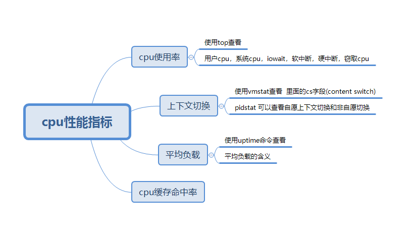

# linux性能优化

看了很多文章，很多大牛都提到要关注自己程序的性能问题。比如说，除了你的程序可以work之外，除此之外，还需要考虑你的程序的cpu占用率，内存占用率，io占用率等。这些都是我之前不太care的事情，我现在才开始考虑这个问题。我试着写一些我的理解和总结。

1. 几个性能指标

* 平均负载

    平均负载 = 活跃进程/ cpu的核心数 ， 活跃进程 = runing的进程 + d状态的进程（不可中断的进程）

* cpu使用率 

    通常情况下，cpu使用率指的是一段时间间隔的cpu使用率。

    cpu 使用率 = （这是时间段内的 cpu idle 的时间 ） / cpu的测试时间段 
    ```
    sudo su
    cat /proc/stat | grep ^cpu
    ```

    **这个计算的是 （用户态占用cpu时间+内核占用cpu的时间）总共占用的cpu的使用率。**


2. 如何发现问题？

    * htop命令可以查看出**瞬时**的资源占用率（cpu，内存等）。如果说，每个进程的cpu的占用率达到了100%，这样是有问题的。说明程序写的非常糟糕。

    * uptime命令可以查看出**平均负载**。

        平均负载的概念非常重要，我简单的理解一下。
        
        平均负载 = 活跃进程/ cpu的核心数 ， 活跃进程 = runing的进程 + d状态的进程（不可中断的进程）

        ```
        uptime
        22:03:55 up 12 min,  0 users,  load average: 0.52, 0.58, 0.59
        ```

        如果系统的平均负载不正常，比如大于1的时候，那可能需要思考一下，是不是出问题了。

    * 使用vmstat命令

        使用mpstat命令，除了可以看到cpu的占用率之外，还可以查看系统的的上下文切换次数和中断的次数。高频次的上下文切换和中断显然会降低系统的性能。

    * 使用pidstat命令

        pidstat命令可以定位到每一个具体的进程，可以看到她的进程切换指标。

        ```
        pidstat -w -u 1   #-w表示加入进程切换的指标
        ```

    * 查看中断次数

        ```
        watch -d cat /proc/interrupts 

        # 输出中的RES 表示的是 中断的次数
        ```

    * perf命令

        使用perf命令可以找到系统的瓶颈，帮助找到问题出现的地方。

        ```
        perf record -a -g sleep 10
        
        -a  采样所有的cpu
        -g  采样调用栈
        sleep 10 采样持续 10s
        ```

        ```
        perf report
        ```

    * sar 命令

        sar 命令 观察网卡的情况
        ```
        sar -n DEV 1  
        #-n DEV 表示显示网络收发的报告，每隔1s输出一次

        18时08分01秒     IFACE   rxpck/s   txpck/s    rxkB/s    txkB/s   rxcmp/s   txcmp/s  rxmcst/s   %ifutil
        18时08分02秒        lo      0.00      0.00      0.00      0.00      0.00      0.00      0.00      0.00
        18时08分02秒      eno1    144.00      2.00      9.08      0.30      0.00      0.00      0.00      0.07

        IFACE 表示 网卡
        rxpck/s 和 txpck/s 表示每秒收发的包
        rxkB/s  和 txkB/s  表示每秒收发的字节
        ```

    * 观察短生命周期的进程

        **短生命周期的进程，如果进程本身有bug，通过情况下它干了坏事，会很快结束。一般的工具命令可能难以发现这样的导致这个问题的真正凶手。尤其是频繁创建和结束的短进程。**

 
        * 使用execsnoop命令
            ```
            execsnoop #命令可以观察短生命周期的进程
            ```

        * 使用perf record 命令


        * 使用pstree的命令

            ```
            pstree -aps pid 
            ```

    * 观察磁盘io

        如果用top查看系统的性能，发现iowait很高。分析的基本思路。

        * 使用iostat 查看磁盘的io情况（但是这个命令只可以看到某一个磁盘的io情况。）
            ```
            iostat 2 3   # 2 3 表示每2s记录一次，连续输出三次

            avg-cpu:  %user   %nice %system %iowait  %steal   %idle
           0.03    0.01    0.03    0.06    0.00   99.88

            Device:            tps    kB_read/s    kB_wrtn/s    kB_read    kB_wrtn
            loop0             0.00         0.00         0.00          8          0
            sda               0.49         5.85        10.65    1106047    2013868

            avg-cpu:  %user   %nice %system %iowait  %steal   %idle
                    0.00    0.00    0.00    0.00    0.00  100.00

            Device:            tps    kB_read/s    kB_wrtn/s    kB_read    kB_wrtn
            loop0             0.00         0.00         0.00          0          0
            sda               0.00         0.00         0.00          0          0

            avg-cpu:  %user   %nice %system %iowait  %steal   %idle
                    0.00    0.00    0.00    0.38    0.00   99.62

            Device:            tps    kB_read/s    kB_wrtn/s    kB_read    kB_wrtn
            loop0             0.00         0.00         0.00          0          0
            sda               1.00         0.00        24.00          0         48
            ```

        * 使用dstat命令

            ```
            dstat 2 3
            ----total-cpu-usage---- -dsk/total- -net/total- ---paging-- ---system--
            usr sys idl wai hiq siq| read  writ| recv  send|  in   out | int   csw 
              0   0 100   0   0   0|5973B   11k|   0     0 |   0     0 |  49    89 
              0   0 100   0   0   0|   0     0 | 292B  590B|   0     0 |  56    98 
              0   0 100   0   0   0|   0     0 | 346B  342B|   0     0 |  51    94 
              0   0 100   0   0   0|   0     0 | 246B  342B|   0     0 |  49    83 
            ```

        * 使用pidstat命令

            ```
            pidstat -d  1  3   
            # 1 3 表示 1秒输出一次，连续输出3次
            ```

            ```
            pidstat -d -p pid  1  3  
            # 1 3 表示 1秒输出一次，连续输出3次
            ```
        

3. linux的一个压力测试的工具

    * stress命令

        stress可以对某个和cpu模拟出计算密集型的任务和io密集的任务。

    * sysbench 命令

        可以模拟出线程的切换
        ```
        sysbench --num-threads=30 --max-time=30000 --test=threads run
        ```

    * apache ab命令
        ```
        ab -c 10 -n 100000 http://192.168.3.110/cal.php?verbose=1
        ```

    * hping3 命令
        ```
        hping3 -S -p 8080 -i u100 192.168.3.110

        # -S 表示tcp协议的syn ，只发送syn包
        # -i 表示100毫秒发送一个
        # -p 端口
        # 这是一个syn攻击
        ```

4. 观察工具

    * watch 命令
        ```
        watch -d cat /proc/softirqs
        # cat /proc/softirqs 是查看系统的软中断次数，但是这个是系统开机到现在的次数，如果我查看这段事件的变化的话，watch命令就很方便了。

        watch -d netstat -atunlp
        ```

    * time 命令 

        ```
        time a.out 
        # 一个可执行文件的执行时间
        ```


### 分析cpu的瓶颈




