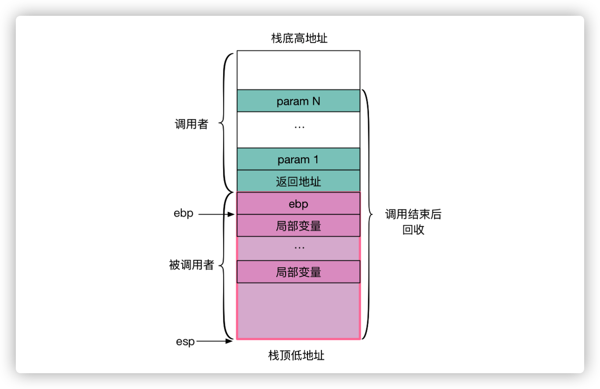
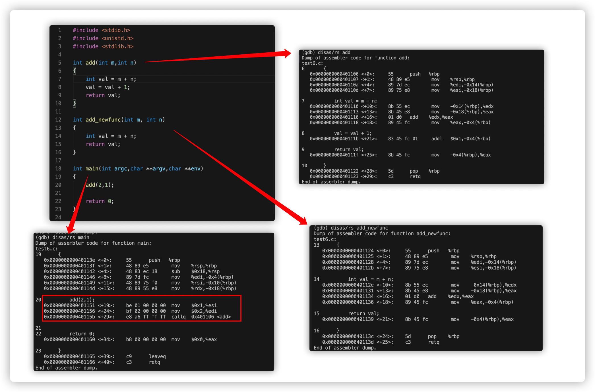
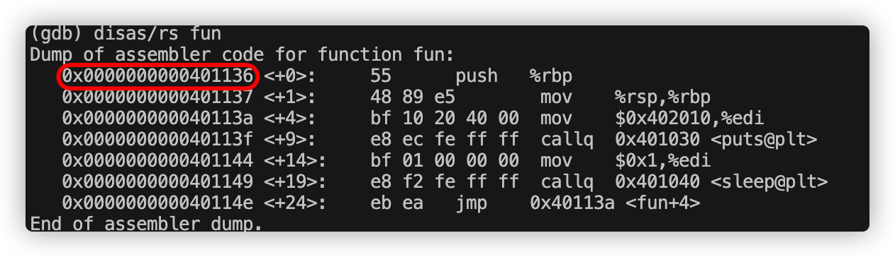
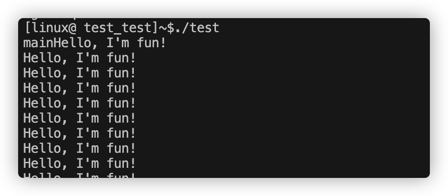

# 函数的调用过程

## 目录

* [函数的调用过程统](#函数的调用过程)
* [函数栈切换](#函数栈切换)
* [协程的基本原理](#协程的基本原理)
* [热更新的基本原理](#热更新的基本原理)
---

## 函数的调用过程

* 函数的调用栈示意图:


* 函数调用对应的汇编代码:


    通过gdb disas/rs + 函数名称 可以查看对应的汇编代码。查看汇编发现:

    1. 在main调用add函数的时候，这里的参数是通过寄存器在传递的
    2. 每进入一个新的函数之后，都是 push %rbp，mov %rsp,%rbp。开辟新的rbp 和 rsp
    3. 返回的返回值存放在eax中
    4. 函数如何return （todo）

    获得使用objdump可以查看汇编代码：
    ```
    objdump -d ./a.out
    ```
* c调用汇编的代码

    在c语言中，使用asm可以调用汇编:
    ```
    void function();

    void test()
    {
        int val = 10;
        printf("val %d\n", val);
        
        // set val = 11
        asm("movl $0xb, -0x4(%rbp)");
        printf("val %d\n", val);
        
        long addr = function;
        asm("movl $0x401156, 0x18(%rbp)");
    }
    ```

    完成代码：
    [example_code](../example_code/function/test_asm.c)

* gdb 查看寄存器的值

    ```
    (gdb) i register
    rax            0x401197            4198807
    rbx            0x0                 0
    rcx            0x7ffff7dce738      140737351837496
    rdx            0x7fffffffe398      140737488348056
    rsi            0x7fffffffe388      140737488348040
    rdi            0x1                 1
    rbp            0x7fffffffe2a0      0x7fffffffe2a0
    rsp            0x7fffffffdaf0      0x7fffffffdaf0
    r8             0x7ffff7dcfce0      140737351843040
    r9             0x7ffff7dcfce0      140737351843040
    r10            0xffffffff          4294967295

    (gdb) i registers eax
    eax            0xf7811010          -142536688
    ```

## 函数栈切换

搞明白函数的调用过程，可以进一步去思考如何去进行函数切换。

1. 思路1：堆栈溢出攻击

    覆盖返回地址，实现函数跳转。
    ```
    #include <stdio.h>
    #include <stdlib.h>
    #include <unistd.h>
    #include <unistd.h>

    void fun() 
    {
        while(1) 
        {
            printf("Hello, I'm fun!\n");
            sleep(1);
        }
    }

    int foo2()
    {
        long a[5] = { 0 };
    
        // 溢出攻击
        a[9] = fun;                 // 覆盖返回地址  // 为什么是a[9] 尝试不同的移动偏移去覆盖rbp的上一条地址 (不同的机器可能不太一样)
    }

    int main() 
    {
        printf("main \n");
        foo2();
        return 0;
    }
    ```


2. 思路2：覆盖函数的地址的汇编代码，实现函数跳转

    ```
    void fun() 
    {
        while(1) 
        {
            printf("Hello, I'm fun!\n");
            sleep(1);
        }
    }

    int foo()
    {
        int a[5] = { 0 };
    
        // 溢出攻击
        asm("mov $0x401136,%eax");    // 0x401136 是fun的入口地址
        asm("mov %rax,0x18(%rbp)");
    }
    ```

    fun的地址可以通过查看汇编代码找到：
    

    执行结果：
    

3. 思路3：覆盖函数的地址首部，插入跳转到其他函数的汇编代码，实现函数跳转

    如果想要从函数a调到函数b，可以把函数b的栈copy覆盖过去。

    ```
    // 希望跳转到的函数
    (gdb) disas/rs MyFunctionNew
    Dump of assembler code for function MyFunctionNew:
    0x0000000000401334 <+0>:     55      push   %rbp
    0x0000000000401335 <+1>:     48 89 e5        mov    %rsp,%rbp
    0x0000000000401338 <+4>:     89 7d ec        mov    %edi,-0x14(%rbp)
    0x000000000040133b <+7>:     89 75 e8        mov    %esi,-0x18(%rbp)
    0x000000000040133e <+10>:    c7 45 fc 0a 00 00 00    movl   $0xa,-0x4(%rbp)
    0x0000000000401345 <+17>:    8b 45 fc        mov    -0x4(%rbp),%eax
    0x0000000000401348 <+20>:    5d      pop    %rbp
    0x0000000000401349 <+21>:    c3      retq   
    End of assembler dump.
    ```


    ```
    // 希望跳转到的函数的对应的汇编代码
    char new_func[] = 
    {
    0x55,
    0x48, 0x89, 0xe5, 
    0x89, 0x7d, 0xec, 
    0x89, 0x75, 0xe8, 

    0xc7, 0x45, 0xfc, 0x0a, 0x00, 0x00, 0x00,

    0xc7, 0x45, 0xf8, 0x01, 0x00, 0x00, 0x00, 

    0x8b, 0x45, 0xfc, 
    0x5d, 
    0xc3  
    };
    ```

    ```
    // 用新的代码去覆盖旧的函数的代码
    int len = sizeof(new_func);
    memcpy((void*)MyFunction, (void*)new_func, len);
    ```

    完成代码：

    [example_code](../example_code/function/test.c)

4. set/jump的方案

    ```
    jmp_buf env;

    int my_func(int a, int b) 
    {
        if (b == 0) {
            printf("do not allow division by 0\n");
            longjmp(env, 1);
        }
        return a / b;
    }

    int main(int argc, char const *argv[]) 
    {
        int res = setjmp(env);
        if (res == 0) {
            printf("return from setjmp\n");
            my_func(10, 0);
        } else {
            printf("return from longjmp: %d\n", res);
        }
        return 0;
    }
    ```

    完成代码：

    [example_code](../example_code/function/test_jmp.c)

## 协程的基本原理

* 大概协程实现的几种原理：
    1. 利用libc中的ucontext系统调用实现 （比如云风实现的协程库）
    2. 使用汇编来切换上下文 (比如libco协程库)
    3. 利用C语言语法switch-case的奇淫技巧来实现
    4. 利用setjmp 和 longjmp实现的协程

* 从实现的方案角度，可以分为：
    1. 共享栈协程
    2. 非共享栈协程

    **非共享栈** ：是每个协程单独开辟一块固定大小的空间，用于存放自己的栈数据。这样带来的好处是，每次切换协程的时候，不需要对栈进行拷贝（只需要切换rbp 和 rsp，让它指向需要要被调度执行的协程的栈空间即可）。非共享栈被认为缺点的是，占用内存会更多。在实际中，栈的内存使用其实不多，如果每个栈128K内存，1w个协程才需要1G多的内存。

    **共享栈协程** ：是每个协程在要被切出的时候，开辟一块内存空间，然后把栈（rsp 到 rbp 的长度，在云风实现的库中利用dummy的变量在计算长度）拷贝到申请的内存上。这样的好处是内存的占用会合理（不会分配过多）。缺点是：协程暂停时，需要把用到的栈内存暂时保存起来，等要运行，再把保存的栈内存拷贝回协程执行的栈（有申请，拷贝和切换的成本）。

-----

ucontext --> 网上有个更加简单的例子
libco    --> colin的例子

* ucontext协程库

* libco 上下文切换的思路 

## 热更新的基本原理

    todo
