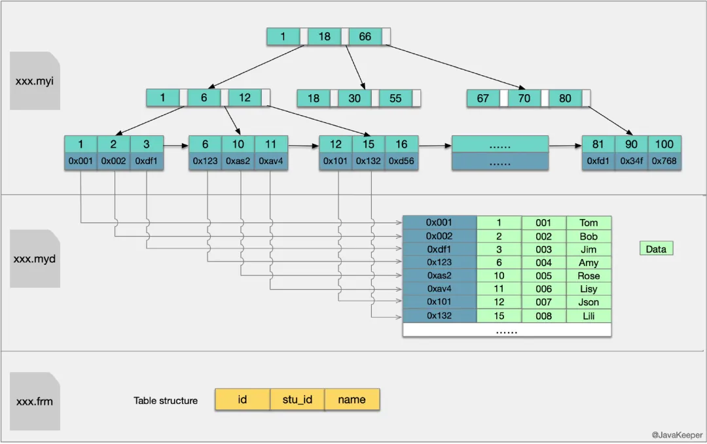
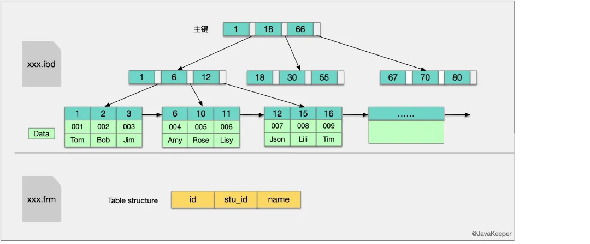
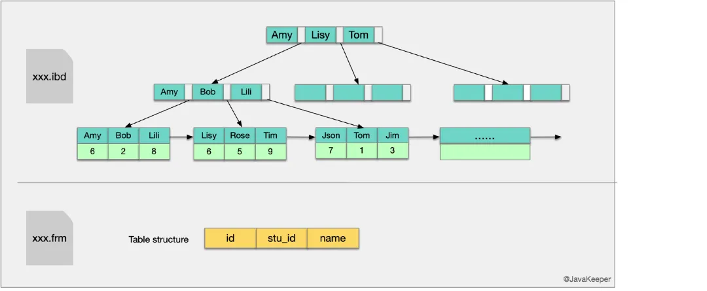
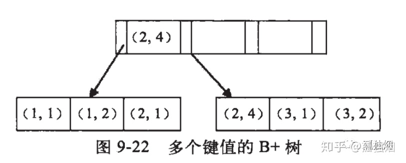

# MYSQL索引


## 目录

* [索引](#索引)

* [字段类型](#字段类型)


---

## 索引


### 索引类型
1. UNIQUE唯一索引

    不可以出现相同的值,可以有NULL值

2. INDEX普通索引

    允许出现相同的索引内容

3. PRIMARY KEY主键索引

    不允许出现相同的值,且不能为NULL值,一个表只能有一个primary_key索引

4. fulltext index 全文索引

    上述三种索引都是针对列的值发挥作用,但全文索引,可以针对值中的某个单词,比如一篇文章中的某个词,然而并没有什么卵用,因为只有myisam以及英文支持,并且效率让人不敢恭维,但是可以用coreseek和xunsearch等第三方应用来完成这个需求。


### innodb的索引和myisam索引结构

* myisam索引


* innodb索引



* innodb辅助索引结构



### 创建索引的原则

1. 维度高的列创建索引

    举个反例，给性别创建索引，是不合适的。因为，理想的索引是要有区分度的，但是，性别索引只能区分出一半的数据，剩下的一般还需要顺序查找。

2. 对常用where，order by ，group by 中加入索引

3. 对字符串使用**前缀索引**

4. 不要过多使用索引

    因为加入索引之后，除了有额外的磁盘开销之外，**另外，每一次插入数据都会导致索引被修改。**

### 索引哪些情况会失效

1. where条件中包含or

    ```
    select * from table where a = "a" or b="b"

    比如字段a是索引列，但是字段b并不是索引列，那么这样的写法无法命中索引
    ```

2. where条件中包含函数，或者where的左侧包含计算

    ```
    select * from table where data(a) = "xxxx"    -- 不会命中索引

    select * from table where a + 10 = 100;       -- 不会命中索引

    select * from table where a = 100 - 10;       -- 命中索引

    这个原理也很简单，如果where的条件包含函数的话，引擎在查询的时候，需要把函数和计算应用到所有的索引节点上。
    ```

3. 使用通配符

    ```
    select * from table where a = "hello%"   -- 命中索引

    select * from table where a = "%hello"   -- 无法命中索引
    ```

4. mysql判断认为全表扫描要比走索引快，会出现不走索引的情况
    ```
    select * from table where a in (xx,xxx,xxxx);

    很多索引的教程都建议不要使用in，使用in的话，会可能无法命中索引。如果in的条件中返回的字段的区分度不大，比如有100w条记录，49w男性，49w女性，2w待定。那么 select * from table where sex in ("男"，"女"),这种情况全表扫描还要快于利用索引。
    ```

### 索引的一些潜规则

* 覆盖索引
* 回表

### b+树索引的优点

* b+树和哈希索引的对比

这两种索引的区别的本质就是哈希表和b+树两种数据结构的区别：
哈希可以通过hash（key）快速命中要查找的记录，但是哈希的缺点是不支持范围查询。

* b+树和其他b树，二叉树的对比

1. b+树的所有叶子节点是连在一起的，对于常见的遍历和扫描操作很方便。

2. b+树是多叉树，所有的叶子节点到根节点的高度是一致的，查询的性能均衡，不会出现像二叉树一样，退化为一个链表。

3. b+树的非叶子节点不包含数据，在io的时候，可以降低io的次数。

### 关于联合索引

联合索引匹配的原则是最左匹配原则。

当我们需要对多个字段查询的时候，可能会用到联合索引。联合索引的原理是一个复合key的b+树。



比如说（a,b）字段进行建立联合索引

这个树的的特点是：
1. 从全局上面看，a是有序的
2. 从全局上面看，b是无序的
3. 如果指定了a，那么b是有序的

搞明白了这个原理，分析sql是否可以命中索引就比较简单了。

```
select * from table where a = 1;  命中

select * from table where a = 1 and b = 1;  命中

select * from table where b = 1;  不会命中，因为全局上b是无序的，需要全部扫描。

select * from table where b = 1 and a = 1; 命令，mysql会优化一把，改为 a=1 and b= 1; 交换一下顺序。
```

在看几个例子：
```
select * from table where a = 1 and b > 1; 命中

select * from table where a > 1 and b = 1; 只有a命中，b命不中。

因为只有指定a的值的时候，b不是有序的。这里a只是一个范围，所以，要找到b，还是需要扫描这张表的。
```

问答环节：
```
SELECT * FROM table WHERE a = 1 and b = 2 and c = 3; 如何加索引？

(a,b,c) 和 （b,a,c) (c,b,a) 或其他顺序都可以；

select * from table where a > 1 and b = 1 and c > 2; 如何加索引？

(b,a) 和 （b,c) 都可以；

select * from table where 
```

参考：

https://zhuanlan.zhihu.com/p/115778804

https://cloud.tencent.com/developer/article/1449114


### like查询 使用索引

下面两条语句，是否可以会命中索引？
```
select * from table where value like "abc%";

select * from table where value like "%abc";
```

如果%写到最前面，那么就不会命中索引。这个一定会扫描所有的数据；如果%写到后面，会命中索引。区别在于%写的越后，扫描的数据越少。

换一个思路，也可以优化第一种情况的case。反转一下需要查询的字符串，这个就会命中。
```
where reverse(字段) like reverse('%abc')

比如原字段是abcd，取反存储为dcba，查询%abc改成查cba%。
```


### 写尽量可以命中索引的sql语句

* 不会命中索引的sql语句
    
    ```
    SELECT `sname` FROM `stu` WHERE `age`+10=30;-- 不会使用索引,因为所有索引列参与了计算

    SELECT `sname` FROM `stu` WHERE LEFT(`date`,4) <1990; -- 不会使用索引,因为使用了函数运算,原理与上面相同

    select * from dept where dname='xxx' or loc='xx' or deptno=45 
    --如果条件中有or,即使其中有条件带索引也不会使用。
    --换言之,就是要求使用的所有字段,都必须建立索引, 我们建议大家尽量避免使用or 关键字
    ```

## 字段类型

* 数值

    int, tinyint, bigint, float, double ...

* 字符串

    varchar,char, ...

    char(20) 和 varchar(20) 的区别 ： 

    CHAR 把这个大小视为值的大小，不长度不足的情况下就用空格补足。而 VARCHAR 类型把它视为最大值并且只使用存储字符串实际需要的长度（增加一个额外字节来存储字符串本身的长度）来存储值。所以短于指示器长度的 VARCHAR 类型不会被空格填补，但长于指示器的值仍然会被截短。

    如果是固定长度的字段，比如md5哈希之后的结果，使用char会比较好。

* 时间

    date，time，year ，datetime，timestamp 

* 符合类型

    枚举 enum ，集合 set

mysql如何选择数据类型：**选择合理范围内最小的**   
```
姓名：char(20)
价格：DECIMAL(7, 3)
产品序列号：SMALLINT(5) unsigned
文章内容: TEXT
MD5: CHAR(32)
ip: char(15)
time: int(10)
email char(32)
```