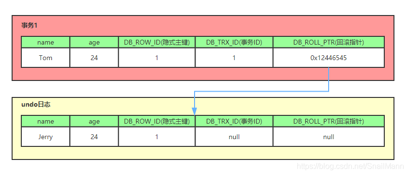

# 数据库MVCC机制

## 目录

* [mvcc的具体实现原理](#mvcc的具体实现原理)

* [mvcc是否可以解决幻读？](#mvcc是否可以解决幻读)

---

## mvcc的具体实现原理？

* mvcc的两种读模式
1. 当前读

    读最新版本是数据，主要应用于更新操作。

    ```
    select * from table where xxx lock in share mode，
    select * from table where xxx for update，
    update table set....
    insert into table (xxx,xxx) values (xxx,xxx)
    delete from table where id = xxx
    ```

2. 快照读

    比如开启一个select查询的事务的时候，读取的只是当前事务的可见版本.

* mvcc实现的原理

    每行记录携带几个隐藏字段

    |isDelete	|DB_TRX_ID	|DB_ROLL_PTR|
    | ---- | ---- | ---- | 
    |true/false|	事务id	|回滚指针	|

    示意图如下：
    

* mvcc如何解决脏读，不可重复读？

    todo

## mvcc是否可以解决幻读？

那么说RR模式下利用MVCC可以解决一定程度上的幻读，但是MySQL没有使用，利用了GAP锁来保证了严格的幻读，其实也就是串行化的一种实现方式吧吗。

如下面的例子，有两个事务，在RR隔离级别下， select是没有幻读的，但select for update却会产生幻读。因为select是读，通过时间戳读快照，事务2读不到事务1的写入。**而select for update被认为是写，是可以更新已提交数据的，所以读到的是最新版本，事务2可以读到事务1的写入。**

```
事务1                                        事务2

mysql> start transaction;                    mysql> start transaction;
Query OK, 0 rows affected (0.00 sec)         Query OK, 0 rows affected (0.00 sec)


                                             mysql> select * from t;
                                             Empty set (0.00 sec)
mysql> insert into t values(1);
Query OK, 1 row affected (0.00 sec)    
mysql> commit;
Query OK, 0 rows affected (0.01 sec)
                                             // no phantom
                                             mysql> select * from t;
                                             Empty set (0.00 sec)
                                             
                                             // phantom
                                             mysql> select * from t for update;  
                                             +------+
                                             | c    |
                                             +------+
                                             |    1 |
                                             +------+
                                             1 row in set (0.00 sec)
                                             // update committed row
                                             mysql> update t set c=2;            
                                             Query OK, 0 rows affected (0.00 sec)
                                             Rows matched: 1  Changed: 0  Warnings: 0

                                             mysql> commit;
                                             Query OK, 0 rows affected (0.01 sec)
```


---

## 参考

1. https://www.zhihu.com/question/334408495/answer/745098902